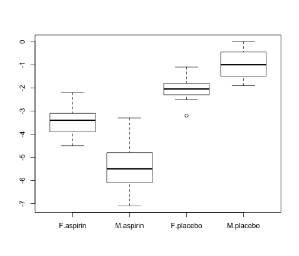

Summarise Data by Group       purple book p26, 3.6.15
========================================================

ref: http://www.cookbook-r.com/Manipulating_data/Summarizing_data/
  
Problem: You want to do summarize your data (with mean, standard deviation, etc.), broken down by group.
 Suppose you have this data and want to find the N, mean of change,
 standard deviation, and standard error of the mean for each group, 
 where the groups are specified by each combination of sex and condition:
 F-placebo, F-aspirin, M-placebo, and M-aspirin.


```r
library(dplyr)
```

```
## 
## Attaching package: 'dplyr'
## 
## The following object is masked from 'package:stats':
## 
##     filter
## 
## The following objects are masked from 'package:base':
## 
##     intersect, setdiff, setequal, union
```

```r
data <- read.table(header=TRUE, text='
                   subject sex condition before after change
                   1   F   placebo   10.1   6.9   -3.2
                   2   F   placebo    6.3   4.2   -2.1
                   3   M   aspirin   12.4   6.3   -6.1
                   4   F   placebo    8.1   6.1   -2.0
                   5   M   aspirin   15.2   9.9   -5.3
                   6   F   aspirin   10.9   7.0   -3.9
                   7   F   aspirin   11.6   8.5   -3.1
                   8   M   aspirin    9.5   3.0   -6.5
                   9   F   placebo   11.5   9.0   -2.5
                   10   M   placebo   11.9  11.0   -0.9
                   11   F   aspirin   11.4   8.0   -3.4
                   12   M   aspirin   10.0   4.4   -5.6
                   13   M   aspirin   12.5   5.4   -7.1
                   14   M   placebo   10.6  10.6    0.0
                   15   M   aspirin    9.1   4.3   -4.8
                   16   F   placebo   12.1  10.2   -1.9
                   17   F   placebo   11.0   8.8   -2.2
                   18   F   placebo   11.9  10.2   -1.7
                   19   M   aspirin    9.1   3.6   -5.5
                   20   M   placebo   13.5  12.4   -1.1
                   21   M   aspirin   12.0   7.5   -4.5
                   22   F   placebo    9.1   7.6   -1.5
                   23   M   placebo    9.9   8.0   -1.9
                   24   F   placebo    7.6   5.2   -2.4
                   25   F   placebo   11.8   9.7   -2.1
                   26   F   placebo   11.8  10.7   -1.1
                   27   F   aspirin   10.1   7.9   -2.2
                   29   F   aspirin   11.3   6.8   -4.5
                   28   M   aspirin   11.6   8.3   -3.3
                   30   F   placebo   10.3   8.3   -2.0
                   ')
```

A boxplot of the data reveals the differences:


```r
boxplot(data$change ~ data$sex + data$condition)
```

 
### Run the functions length, mean, and sd on the value of "change" for each group, 
broken down by sex + condition


```r
data %>% 
  group_by(sex,condition) %>%
  summarise_each(funs(length,mean,sd),change) %>%
  mutate(se=sd/sqrt(length))
```

```
## Source: local data frame [4 x 6]
## Groups: sex
## 
##   sex condition length      mean        sd        se
## 1   F   aspirin      5 -3.420000 0.8642916 0.3865230
## 2   F   placebo     12 -2.058333 0.5247655 0.1514867
## 3   M   aspirin      9 -5.411111 1.1307569 0.3769190
## 4   M   placebo      4 -0.975000 0.7804913 0.3902456
```
