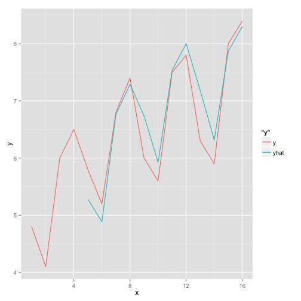

## Holt Winters Seasonal Smoothing, 7.6.16

#### ref: Pink book pg 85


```r
holtWintersSeasonal<-function(){
  md<-c(4.8,4.1,6,6.5,5.8,5.2,6.8,7.4,6,5.6,7.5,7.8,6.3,5.9,8,8.4)
  x<-c(1,2,3,4,5,6,7,8,9,10,11,12,13,14,15,16)
  md<-ts(md,frequency=4)
  HWresult<- HoltWinters(md, alpha=0.3, beta=0.15, gamma=0.2)
  fittedValues<-as.data.frame(HWresult$fitted)
  nans<-rep(NaN,4)
  
  yhat<-c(nans,fittedValues$xhat)
  result<-data.frame(x=x,y=as.numeric(md),yhat=yhat)
  print(result)
  library('ggplot2')
  ggplot(result,aes(x))+geom_line(aes(y=y,colour='y'))+geom_line(aes(y=yhat,colour='yhat'))
}
holtWintersSeasonal()
```

```
##     x   y     yhat
## 1   1 4.8      NaN
## 2   2 4.1      NaN
## 3   3 6.0      NaN
## 4   4 6.5      NaN
## 5   5 5.8 5.281250
## 6   6 5.2 4.885219
## 7   7 6.8 6.767162
## 8   8 7.4 7.291000
## 9   9 6.0 6.740217
## 10 10 5.6 5.925178
## 11 11 7.5 7.534101
## 12 12 7.8 8.003948
## 13 13 6.3 7.181735
## 14 14 5.9 6.317323
## 15 15 8.0 7.870184
## 16 16 8.4 8.303634
```

```
## Warning in loop_apply(n, do.ply): Removed 4 rows containing missing values
## (geom_path).
```

 
  
