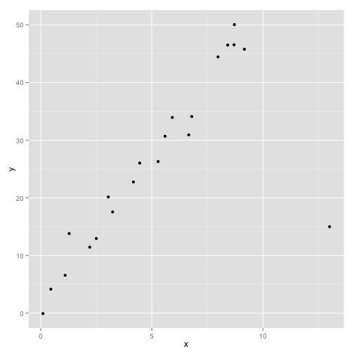
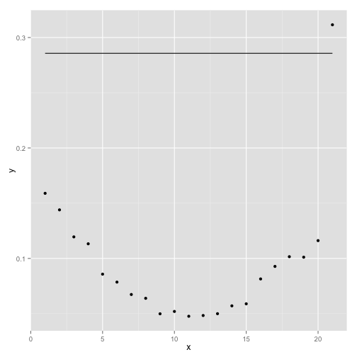

### Influential Values, 12th June 2016
##### ref: Pink iBook pg 67
##### https://onlinecourses.science.psu.edu/stat501/node/338

We can view leverage for each data point in a model  identify it as influential if it is about 3x greater than the mean influence. Remember that leverage can be found as the diagonal elements of the hat matrix.

```r
library(ggplot2)
inf <- read.delim("~/MyR/Regression/influence2.txt")
test_model <- lm(y ~ x, data = inf)
ggplot(inf, aes(x))+geom_point(aes(y=y))
```

 

```r
hv <- data.frame(x=1:nrow(inf), y=hatvalues(test_model))
threshold <- 3 *mean(hatvalues(test_model))
ggplot(hv,aes(x=x)) + geom_point(aes(y=y)) + geom_line(aes(y=threshold))
```

 
The plot of data shows an unusual value. This is is shown in the leverage plot as the last data point & is outside the threshold.
